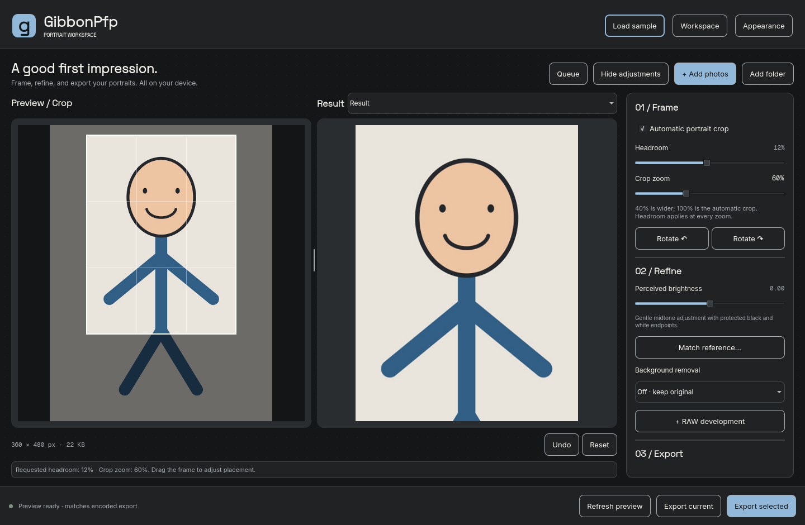

<a id="readme-top"></a>

<div align="center">
  
  <h1>GibbonPfp</h1>
  <p>Frame, refine, and export consistent portraits. All on your device.</p>
  <p>
    <a href="https://github.com/wispdevon/GibbonPfp/releases">Releases</a> ·
    <a href="docs/BUILDING.md">Build instructions</a> ·
    <a href="https://github.com/wispdevon/GibbonPfp/issues">Report a bug / Request a feature</a>
  </p>
</div>

[](https://github.com/wispdevon/GibbonPfp/actions/workflows/build.yml)
[](LICENSE)

## About the project

GibbonPfp is an offline desktop editor and command-line tool for preparing profile
pictures. Import portraits, adjust framing and brightness, optionally remove the
background, and export a single photo or a batch without overwriting originals.
The default output is **360 × 480 pixels, portrait 3:4**.



*Native Linux screenshot using the built-in illustrated sample; no private photos.*

<details>
<summary>Table of contents</summary>

- [Features](#features)
- [Built with](#built-with)
- [Getting started](#getting-started)
- [Desktop usage](#desktop-usage)
- [Background removal and hardware](#background-removal-and-hardware)
- [CLI usage](#cli-usage)
- [Configuration and saved work](#configuration-and-saved-work)
- [Development and validation](#development-and-validation)
- [Project status and roadmap](#project-status-and-roadmap)
- [Contributing](#contributing)
- [Privacy and limitations](#privacy-and-limitations)
- [License](#license)
- [Contact](#contact)
- [Acknowledgments](#acknowledgments)

</details>

### Features

- **Side-by-side editing:** editable Preview / Crop and decoded export Result,
  with a draggable divider and collapsible queue and adjustment panels.
- **Portrait framing:** face-aware automatic crops, adjustable headroom,
  **40–100% crop zoom**, dragging, arrow keys, rotation, and per-photo review gates.
- **A built-in sample:** load a flat stick-figure portrait to try the controls.
- **Refinement:** perceptual brightness and reference-portrait brightness matching.
- **Local background removal:** Fast or optional High Quality, mask inspection,
  keep/remove brushes, feathering, and transparency.
- **Screen sharpening:** enabled by default at Standard; choose Low / Standard /
  High or turn it off.
- **Flexible output:** JPEG or PNG, default size cap, source-sized or custom 3:4
  output without automatic upscaling, prefixes, and collision-safe filenames.
- **Input formats:** JPEG, PNG, WebP, TIFF, HEIC, and camera RAW, with RAW
  white-balance presets, temperature/tint, and highlight recovery.
- **Batch work:** folder import, selection-based adjustments, review/approval,
  automatic processing, reusable presets, sessions, undo, and reset.
- **Appearance:** light/dark themes, 80–150% UI scaling, Graphite/Blue accents,
  and embedded fonts throughout Qt controls and dropdowns.

### Built with

C++20 · Qt 6 Quick/QML · OpenCV · ONNX Runtime · LibRaw · libheif/libde265 ·
libtiff · libwebp · CMake/Ninja. GUI and CLI share the same `gibbon_core` engine.

## Getting started

### Installation

Check [Releases](https://github.com/wispdevon/GibbonPfp/releases) for published
packages. If a package is unavailable for your system, build from source below.
Release targets are Windows 11 x64, Ubuntu 24.04+ x64, and macOS 14+ on Intel and
Apple Silicon. Portable packages are configured to include runtime dependencies,
face detection, and the Fast model. High Quality is a separate download.

These are packaging targets, not a claim that every revision has been validated
on every platform. See [build results](https://github.com/wispdevon/GibbonPfp/actions)
and [distribution notes](docs/BUILDING.md) for the actual build and signing status.

### Build from source

Install Qt 6.8+, a C++20 compiler, CMake, Ninja, Python 3.10+, and the native
libraries listed in [Building and distribution](docs/BUILDING.md). Then:

```bash
git clone https://github.com/wispdevon/GibbonPfp.git
cd GibbonPfp
python3 scripts/fetch_assets.py
cmake --preset dev
cmake --build --preset dev
ctest --preset dev
./build/gibbonpfp
```

On Windows, run `build/gibbonpfp.exe`. On macOS, run
`build/gibbonpfp.app/Contents/MacOS/gibbonpfp`. The installed app does not need a
Python interpreter; Python is used by development scripts.

### Arch Linux and local updates

```bash
# Build, test, and install the current workspace for your user; no sudo.
scripts/install-local.sh

# Alternatively, build a pacman package including local source edits.
scripts/package-arch-local.sh
```

The user install lives under `~/.local` and includes a desktop launcher. Reopen
GibbonPfp after an update; `~/.local/bin/gibbonpfp --version` reports its build ID.
The Arch package uses system libraries and requires administrator authentication
to install. An AUR-ready `gibbonpfp-git` recipe is in [packaging/aur](packaging/aur);
adding it to this repository does not automatically publish it to AUR.
See [Arch packaging](docs/BUILDING.md#arch-linux--aur-and-local-updates).

## Desktop usage

1. **Add photos**, **Add folder**, or **Load sample**. Folder import includes subfolders.
2. Select a portrait and adjust **Frame**, **Refine**, and **Export**.
3. Inspect the right **Result** pane: it shows the actual decoded JPEG/PNG output.
4. For a batch, use **Apply settings to selected**, then **Prepare selected**.
   Individual crop geometry and zoom stay with their photos; strokes are not copied.
5. Adjust or approve photos marked **Needs review**, or explicitly choose the
   **Fully automatic batch** policy and apply it to the selection.
6. Export the current photo or selected batch to an output folder.

### Crop, headroom, and zoom

- **100%** uses the automatic frame; **40%** shows a wider frame.
- Headroom is the requested fraction between the top of the crop and the estimated
  top of the head. Its default is **8%**, adjustable from **0–25%**.
- Zoom accounts for headroom. Changing headroom recalculates the frame **without
  resetting your chosen zoom percentage**.
- Source boundaries can limit widening or headroom; the app reports the limitation.
- Drag the left crop, or focus it and use arrow keys. Moving the frame, undo, and
  sessions preserve the selected zoom. Older sessions with a manual crop use that
  saved frame as their 100% baseline.

Both panes share the completed export preview. The left shows it inside the crop,
with the source dimmed outside; the right shows **Updating…** while processing.
Mouse-driven sliders and crop dragging process on release. **Refresh preview**
explicitly recomputes the current settings.

**Load sample** generates an illustration in the app cache. Its known head geometry
makes it useful for trying zoom and headroom. Only the exact generated sample uses
synthetic landmarks; imported photos use face detection. Repeated clicks select
its existing queue entry.

### Masks and screen sharpening

Use the right pane's **Result / Mask** selector to inspect output or the mask.
Both removal modes see **10 percentage points of wider crop context**: a 65%
export crop uses a 55% removal frame, and 40% uses a removal-only 30% frame.
The extra frame follows the current crop position and headroom anchor, limited
by source boundaries. The predicted mask is mapped back onto your selected crop;
export framing, dimensions, and brush coordinates stay unchanged. This puts model
boundary imperfections farther outside the finished crop where space permits.
Keep/remove brushes work on crop coordinates. Framing changes clear strokes;
**Edge feather** shows its value in output pixels (0–10 px, in 0.5 px steps).
New photo settings default to **0.0 px**, so Fast has no added feather blur.
Fast uses MODNet portrait matting at 512 × 512, then refines its prediction against the source crop at up to
1200 × 1600 pixels (1.92 MP), before resizing the mask for export. Image-guided
refinement aligns the boundary with visible luminance edges. Confident background
(≤10%) becomes transparent and confident foreground (≥90%) becomes opaque; image
borders replicate neighboring pixels so refinement adds no transparent border.
This is higher-resolution reconstruction, not a higher-resolution neural model,
and cannot recover every missed hair or separate similar-colored regions.
Uncertain boundary probabilities and mask resizing can still produce
partially transparent pixels at zero. Feathering affects the automatic mask;
manual Keep/Remove strokes are applied afterward with firm edges. Mask inspection
uses unsmoothed pixels so brush boundaries remain clear. Increase feathering to
add blur to the automatic mask explicitly;
saved presets and sessions retain their chosen value. Transparent pixels appear
against a checkerboard.
Export PNG to retain transparency or JPEG to composite onto the selected backdrop.

**Sharpen for screen** is checked by default at **Standard** in Export. Low and
High decrease or increase its strength. It runs after resizing and brightness,
before background composition and encoding, so both previews and exports include
it. These are GibbonPfp's own presets using Lightroom-style level names, not an
exact reproduction of Lightroom or Capture One's proprietary processing.

### Appearance and navigation

**Appearance** offers Light/Dark theme, UI scales of **80%, 90%, 100%, 110%, 125%,
and 150%**, and **Graphite / Blue** button accents. Defaults are 100% and Graphite;
theme initially follows the OS. Preferences apply immediately and persist locally.

Inter Medium is used for work text and Qt dropdown entries, DemiBold for actions,
Space Grotesk Bold for headings, and Geist Mono for dimensions and zoom readouts.
Fonts are embedded and checked at startup. UI scaling includes controls, spacing,
panels, and app popups, on top of Qt display scaling. Native OS file dialogs retain
their system typography and scaling. On Linux, import, export-folder, and session
dialogs use the XDG desktop portal. To select GTK, install `xdg-desktop-portal-gtk`
and set `org.freedesktop.impl.portal.FileChooser=gtk` in the `[preferred]` section
of `~/.config/xdg-desktop-portal/portals.conf`. Export dimensions do not change.

**Queue** and **Adjustments** toggle sidebars; narrow workspaces show one at a time.
Adjustments scroll independently. **Workspace** contains sessions and model management.

## Background removal and hardware

### Which mode should I use?

| Mode | What it loads | Model file size | Inference input | Intended use |
| --- | --- | --- | --- | --- |
| Off | No background-removal inference | — | — | Preserve the existing background |
| Fast | MODNet photographic portrait ONNX model, bundled | 25.89 MB | 512 × 512 | Portrait matting with a smaller model than High Quality |
| High Quality | Optional BiRefNet portrait ONNX model | 972.67 MB (about 928 MiB) | 1024 × 1024 | Portrait-focused masking when Fast is insufficient |

Automatic framing can still use the bundled YuNet face detector (0.23 MB) and
Fast model to estimate head position, even when background removal is Off.
Model identities, exact download URLs, and SHA-256 hashes are pinned in the
[manifest](assets/models/manifest.json); inference is implemented in [models.cpp](src/models.cpp).

### What does High Quality do, and what does it load?

High Quality uses **BiRefNet's human-portrait model** to estimate which pixels
belong to the subject. It produces a soft foreground mask, which GibbonPfp uses
for PNG transparency or JPEG background composition. It does not generate a new
person, replace facial features, or recover missing image detail. The upstream
model is identified as `birefnet-portrait` in [rembg's model list](https://github.com/danielgatis/rembg#models).

The downloaded file is **`BiRefNet-portrait-epoch_150.onnx`**, exactly
**972,666,916 bytes**, hosted in the pinned rembg release. GibbonPfp loads that
model through ONNX Runtime; it does **not** install Python, PyTorch, or the rembg
application. Downloading stores the file on disk. The inference session is created
when an image first needs High Quality and then cached for reuse. The desktop
asks **Load High Quality?** before that first load, with the RAM estimate and
cache lifetime. This covers previews, batches, exports, presets, and restored
sessions. **Cancel** stops the pending operation without loading the model or
changing the existing preview; choose Fast or Off to continue without High Quality.
A failed load asks again on retry. After a successful load, later uses do not
prompt or reload the model while the app remains open. Confirmation is not saved
across app restarts. The CLI remains non-interactive.

For High Quality, the pipeline extracts the wider removal frame from the source
and bounds its long edge to 1024 pixels, then resamples it to the model's fixed
1024 × 1024 input. The predicted mask is mapped back to the selected export crop.
Fast uses the same surrounding context with refinement bounded to a 1600-pixel
long edge. Neither mode enlarges the export. Feathering and manual strokes apply
after mapping, with feathering before strokes. See [engine.cpp](src/engine.cpp).

Portrait-focused inference may improve a difficult mask, but **High Quality is not
a guarantee of better results on every photo**. Check hair, glasses, clothing,
semi-transparent edges, and similar-colored backgrounds. The app uses the ONNX
mask plus its own strokes/feathering; additional rembg matting or color-cleanup
options are not implicitly included.

### RAM, VRAM, disk, and speed

| Resource | What to expect for High Quality |
| --- | --- |
| System RAM | Plan for roughly **8–10 GB available** to the app; **16 GB total** is a practical starting point, with **32 GB** more comfortable for large RAW files and multitasking. |
| Dedicated VRAM | Optional for CPU mode. CUDA uses GPU memory for weights, intermediate tensors, and workspace; High Quality can exceed available VRAM. No universal VRAM minimum has been measured. |
| GPU acceleration | Automatic NVIDIA CUDA selection with a compatible CUDA-enabled ONNX Runtime, CUDA, and cuDNN. CPU fallback on initialization or execution failure. DirectML and Core ML are not implemented. |
| Disk | About **973 MB** for the optional model, plus room for the application, photos, and exports. |
| Latency | Allow for slow initial loading and potentially tens of seconds per image on CPU. Actual time depends on hardware, memory pressure, and runtime version. |

**These RAM and latency figures are planning estimates, not measured minimums or
cross-platform benchmarks.** Model weights are only part of the memory footprint:
intermediate tensors, runtime allocations, decoded photos, and previews also use
RAM. A 973 MB file does not imply a 973 MB working set.

### GPU acceleration

The shared desktop/CLI engine automatically tries NVIDIA CUDA when the linked
ONNX Runtime exposes that provider. Unsupported operations can still use CPU.
Session initialization or GPU execution failures retry on CPU, which remains
selected for that model until sessions are released. **Models** displays the selected device
for each loaded model. Image decoding, cropping, mask refinement, and export
encoding still run on CPU. Sessions remain cached on their selected device.

On Arch, use `onnxruntime-cuda` with compatible CUDA/cuDNN packages. Standard
bundled release runtimes are CPU-only; Windows CUDA requires a compatible runtime
build and libraries too. AMD/Intel GPU and Apple acceleration are not implemented.
See [ONNX Runtime CUDA requirements](https://onnxruntime.ai/docs/execution-providers/CUDA-ExecutionProvider.html).
To force CPU use for troubleshooting or to reserve VRAM, launch:

```bash
GIBBON_INFERENCE_DEVICE=cpu gibbonpfp
```

Fast now uses [MODNet](https://github.com/ZHKKKe/MODNet), a portrait-matting network,
with a pinned [Xenova ONNX conversion](https://huggingface.co/Xenova/modnet).
It is larger than the old 6.16 MB PPHumanSeg model but far smaller than High Quality.
A local synthetic 512 × 512 CPU inference test took roughly 0.2 seconds per run;
on this RTX 3060 Ti machine, a warmed CUDA inference took approximately 19–20 ms
(first inference about 608 ms). ONNX profiling confirmed CUDA execution. These
figures exclude decoding/refinement/export and are not cross-platform benchmarks.
The higher resolution and portrait-matting objective target finer subject edges;
quality still depends on the photo. Existing `background: fast` settings use the
new model without changing saved crop or brush coordinates.

**Would downscaling a 16–24 MP original to 2 MP speed up High Quality?**
It can reduce source decoding and resizing costs, but it does not reduce the
fixed 1024 × 1024 model computation. Segmentation receives a surrounding source crop already bounded to a
1024-pixel long edge before its model-specific resize. The original
is released before background inference. Keeping the model loaded saves startup
costs. A shared 128 MiB in-memory LRU cache reuses face detections and automatic
masks for compatible edits, including feather, brushes, brightness, sharpening,
backdrop, and encoding changes. Keys include processing pixels, dimensions, model
checksum, preprocessing version, purpose (head or export), and execution device.
Changed source pixels or removal context trigger new inference; entries are owned
copies before feathering and strokes. Failed or cancelled processing clears the
cache. Decoding and export still run on each preview. Use Fast for more responsive adjustments, then High Quality for the final
mask. There is no measured High Quality speedup from a 2 MP input cap in this app.

**Models → Processing device** offers Automatic (default) and CPU. This local
preference persists separately from photo settings, presets, and sessions. The
`GIBBON_INFERENCE_DEVICE=cpu` launch override takes priority and is shown in Models.
Models shows each session’s selected device, readable CPU fallback reasons, and
expandable technical errors. **Release loaded models** frees sessions and the
processing cache while retaining photos, edits, and the completed preview. Device
changes do the same. Both controls are disabled during processing. Releasing High
Quality resets its load confirmation; its next use asks again.

Loaded model sessions stay cached until released, the app closes, or the CLI exits.
Switching back to Fast or Off does **not** unload an already loaded High Quality
session. Use **Release loaded models** if you need to release that memory.
Batch work processes photos sequentially; larger sources and uncapped outputs
can still increase peak RAM. Use Fast when memory or responsiveness matters most.

### Install and use High Quality

In the desktop app, open **Workspace → Models → Download High Quality**. After the
download completes, select **High Quality · portrait** under Background removal.
Or use the CLI:

```bash
gibbonpfp models list
gibbonpfp models install quality
gibbonpfp process portrait.jpg --output profiles/ --background quality --format png
```

Installation downloads over HTTPS and verifies the pinned SHA-256 before accepting
the file. Subsequent inference is offline. Missing or corrupted weights produce
a repair instruction. Models are stored in Qt's application-local data directory
under `models/`; `GIBBON_MODEL_DIR` adds a model lookup directory. The CLI installation
command prints the installed path. High Quality is excluded from default packages.

## CLI usage

```bash
# Prepare a batch; uncertain photos are held and recorded in the report.
gibbonpfp process photos/ --output profiles/ --report report.json

# Explicit automatic policy: largest face, or a center crop when no face is found.
gibbonpfp process photos/ --output profiles/ --fully-automatic --recursive

# Fast removal and transparent PNG output.
gibbonpfp process portrait.jpg --output profiles/ --background fast --format png

# Source crop resolution or custom 3:4 output; never automatically upscaled.
gibbonpfp process portrait.jpg --output profiles/ --uncapped
gibbonpfp process portrait.jpg --output profiles/ --uncapped --size 720x960

# Brightness, reference matching, and screen sharpening.
gibbonpfp process photos/ --output profiles/ --brightness 0.3
gibbonpfp process photos/ --output profiles/ --reference reference.jpg
gibbonpfp process portrait.jpg --output profiles/ --screen-sharpening low
gibbonpfp process portrait.jpg --output profiles/ --screen-sharpening off

# RAW development followed by the same portrait pipeline.
gibbonpfp process portrait.NEF --output profiles/ --white-balance custom \
  --temperature 5500 --tint 1.05 --highlight 3

# Desktop presets also work with the CLI; reports support JSON and CSV.
gibbonpfp process photos/ --output profiles/ --preset preset.json --report report.csv
gibbonpfp --help
```

Exit codes: **0** success; **2** held photos or per-file failures; **1** invalid
options or a fatal error; **130** interrupted processing. Each processed input
produces a JSON result line on stdout. Reports contain source/output paths,
status, and warnings/errors. JSON results also include `diagnostics`: total wall
time in milliseconds, ordered exclusive stage timings, selected model devices,
and cache hits/misses. Warm cache reuse has its own stage instead of inference.
Filename collisions receive numeric suffixes.

Desktop processing shows the current stage and operation elapsed time; batches
include the current photo number. Cancellation stays pending until an active
native decoder/inference call returns. Worker progress is marshalled onto the UI
thread and outdated operation updates are discarded. No estimated percentages
are shown.

## Configuration and saved work

Presets are versioned JSON shared by GUI and CLI. Save one from the desktop for
the complete settings shape. `cropZoom` is available in settings/presets; it is
not a separate CLI flag.

| Setting | Default | Behavior |
| --- | --- | --- |
| `autoCrop` | `true` | Estimate a head-and-shoulders frame |
| `cropZoom` | `100` | 40–100%; lower values widen automatic framing |
| `headroom` | `0.08` | Requested fraction above the estimated head; 0–0.25 |
| `capped` | `true` | Maximum 360 × 480 pixels |
| `width`, `height` | `360`, `480` | Exact 3:4; both `0` for source-sized uncapped output |
| `brightness` | `0` | Gentle lightness shift, −1 to 1 |
| `background` | `off` | `off`, `fast`, or `quality` |
| `feather` | `0` | Additional mask blur, 0–10 output pixels in the desktop |
| `sharpenScreen` | `true` | Apply sharpening at final output size |
| `sharpening` | `standard` | `low`, `standard`, or `high` |
| `format`, `quality` | `jpeg`, `92` | JPEG/PNG format and JPEG quality |
| `automatic` | `false` | Allow uncertain crop fallbacks to export |

Sessions store source paths, per-photo settings, crop baselines and zoom,
selection, approvals, and strokes; **they do not embed photos**. Preserve the
original files. Presets omit photo-specific crop geometry, strokes, approvals,
and reference paths. Settings changes invalidate approval for the affected image.

Theme, UI scale, and accent are separate local interface preferences. They do not
alter photo settings, presets, sessions, CLI processing, or export dimensions.

## Development and validation

```bash
cmake --build --preset dev
ctest --preset dev
python3 scripts/test_cli.py build/gibbonpfp

# Optional native Qt screenshot matrix using synthetic inputs.
GIBBON_TEST_SCREENSHOTS=/tmp/gibbon-ui-checks ctest --preset dev -R controller
```

### Public portrait benchmarks

```bash
python3 scripts/benchmark.py --download
# Explicit opt-in only; requires the separately installed quality model.
python3 scripts/benchmark.py --quality --output ~/.cache/gibbon-benchmarks/reports/quality
```

The six [pinned Commons portraits](benchmarks/portraits.json) include attribution,
license links, checksums, and visual challenge categories. Downloads and reports
stay under `~/.cache/gibbon-benchmarks`, outside Git. The runner uses `gibbon_core`
with fixed 360 × 480 PNG, 65% export / 55% removal context, zero feather, and
Standard sharpening. Each image has a cold model/cache run and three warmed runs;
OS disk caches are uncontrolled. Reports include stage timings, devices, cache
reuse, sampled RSS where available, and process-lifetime peak memory where
supported. GPU memory is explicitly unavailable. The source/mask/black/white
contact sheet needs visual review; no ground-truth accuracy score is calculated.
Derived images carry the source license and an attribution/changes file.
Local installation runs Fast whenever these public fixtures are cached. It never
implicitly downloads benchmark portraits or runs High Quality. Development needs
`curl` for downloading; the native runner builds with `BUILD_TESTING=ON`.

Validation includes core/controller tests, CLI integration, and native Qt
screenshots. Browser tools do not inspect this desktop interface. The screenshot
above is Linux evidence; it does not establish Windows/macOS visual equivalence.
See [Building and distribution](docs/BUILDING.md) for packaging, installed-binary
checks, platform dependencies, licensing, and signing.

```text
src/                 Shared engine, codecs, models, CLI, Qt controller, font loading
qml/                 Desktop workspace and appearance controls
assets/              Embedded fonts, icons, model manifest, and notices
tests/               Core/controller tests and synthetic fixtures
scripts/             Asset fetch, validation, local installation, and packaging
packaging/aur/       Arch PKGBUILD and AUR metadata
cmake/               Runtime setup and dependency triplets
docs/                Build/distribution notes and native workspace screenshot
.github/workflows/   Native desktop build/test/package matrix
```

## Project status and roadmap

Current functionality includes the two-pane editor, headroom-aware percentage
zoom, sample portrait, screen sharpening, embedded Qt typography, and Arch/local
installation workflows. Track bugs and proposed work in
[Issues](https://github.com/wispdevon/GibbonPfp/issues); this README does not promise
unimplemented features or a release schedule. Additional GPU providers, cloud processing,
and animated/multipage image workflows are outside the current scope.

## Contributing

1. Open an issue describing the problem or proposed change.
2. Fork the repository and work on a focused branch.
3. Follow [AGENTS.md](AGENTS.md), [DESIGN.md](DESIGN.md), and the build instructions.
   Keep image processing in `gibbon_core` so desktop and CLI behavior agree.
4. Run the relevant tests and include native screenshots for UI changes.
5. Use a Conventional Commit subject and open a pull request with the change and
   validation results. Do not commit ONNX weights, build products, or private photos.

## Privacy and limitations

- **Local processing:** no accounts, analytics, uploads, or cloud inference.
  Only explicit model installation uses the app's network download path.
- **Originals stay untouched:** exports remove source EXIF/GPS metadata and include
  an sRGB profile. Batch exports also write a JSON report in the output folder.
  Session/report files contain local paths; share them deliberately.
- **Framing is a heuristic:** 8% headroom and the automatic head-size target are
  composition choices, not identity-photo certification. Hats, poses, cropped
  heads, and multiple subjects can require review.
- **Masks need inspection:** neither removal model guarantees perfect hair,
  transparent edges, or separation from a similar-colored background.
- **Sharpening can emphasize noise:** the current screen presets use an
  alpha-weighted luminance unsharp mask, 0.6px Gaussian sigma, a 1/255 detail
  threshold, and amounts 0.35/0.65/1.0. Adjustment is limited to ±0.1; alpha is unchanged.
- **JPEG remains lossy:** brightness uses a monotonic Oklab lightness curve with
  endpoint protection and gamut mapping, but encoding cannot guarantee that every
  tonal distinction survives compression.
- **RAW support is bounded by LibRaw:** development is not the camera maker's
  picture style. Temperature/tint are approximate; highlight recovery cannot
  restore clipped sensor data. Universal camera compatibility is not promised.
- **HEIC input is SDR:** PQ/HLG HDR HEIC must be converted to SDR first.
- **Cancellation has stage boundaries:** an active decoder or inference call
  finishes before cancellation is observed. High Quality may therefore take time to stop.

## License

GibbonPfp is licensed under [Apache-2.0](LICENSE). Dependencies, fonts, and model
weights retain their own licenses; see [Third-party notices](THIRD_PARTY_NOTICES.md)
and the notices distributed with the application.

## Contact

Built by [Devon Labs](https://devonlabs.space).
For support, bug reports, and feature requests, use
[GibbonPfp Issues](https://github.com/wispdevon/GibbonPfp/issues).

## Acknowledgments

- [Best-README-Template](https://github.com/othneildrew/Best-README-Template) for the README structure.
- [BiRefNet](https://github.com/ZhengPeng7/BiRefNet) and [rembg](https://github.com/danielgatis/rembg) for portrait segmentation research and the published ONNX model.
- [OpenCV Zoo](https://github.com/opencv/opencv_zoo) for YuNet face detection.
- [MODNet](https://github.com/ZHKKKe/MODNet) and [Xenova](https://huggingface.co/Xenova/modnet) for Fast portrait matting.
- Qt, ONNX Runtime, OpenCV, and the native image-codec projects.
- Inter, Space Grotesk, and Geist Mono, bundled under the SIL Open Font License.
- Strider's editorial workspace design, adapted in [DESIGN.md](DESIGN.md).

[Back to top](#readme-top)
